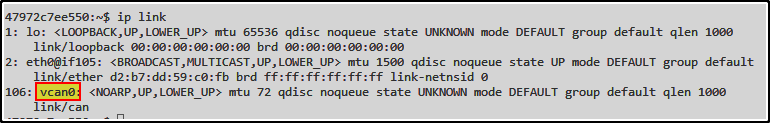

# BlockHarbor Proving Grounds - Can you find the interface?

**Category**: Getting Started<br>
**Points**: 5<br>
**Challenge description**: This challenge is within the Harborbay vehicle simulator on VSEC. From the home page, enter HarborBay. Select the Mach-E UDS Challenge Simulation, then launch the terminal. What is the name of the CAN interface available on the virtual terminal?

## TL;DR

After launching the Mach-E UDS Challenge Simulation in the HarborBay vehicle simulator, I needed to identify the available CAN interface. Using the `ip link` command in the virtual terminal revealed the interface name `vcan0`, which was the solution to this challenge.

## Writeup

The challenge description already gave us a nice breadcrumb trail to follow:

1.  On the VSEC dashboard, select the **Garage** block.
2.  Select the UDS Challenge Simulation
3.  Launch the terminal

Once I got the terminal up and running, I needed to find the CAN interface. For those who aren't familiar, CAN (Controller Area Network) is a standard used in vehicles for communication between different electronic components. Finding the interface is a fundamental first step for any automotive security testing.

### Finding the Interface

When working with network interfaces in Linux systems, the `ip` command is your best friend. Specifically, `ip link` shows all network interfaces on the system.

I typed:
```bash
ip link
```

And boom! Among the output, I spotted our answer: **`vcan0`**


## What This Means

The "v" in `vcan0` stands for "virtual" - this is a virtual CAN interface that simulates a real CAN bus for testing purposes. This makes perfect sense in a simulator environment where we don't have physical hardware.

Flag: `vcan0`

## Learning Points

-   Always check available interfaces when starting automotive security challenges
-   The `ip link` command is essential for network interface discovery
-   Virtual CAN interfaces (vcan) are commonly used in simulation environments

Next time you're diving into automotive security challenges, remember to check what interfaces are available first - it's your gateway to the vehicle's communication systems!