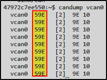

# BlockHarbor Proving Grounds - Arbitration

**Category**: Getting Started<br>
**Points**: 5<br>
**Challenge description**: This challenge is within the Harborbay vehicle simulator on  [VSEC](https://vsec.blockharbor.io/). From the home page, enter HarborBay. Select the Mach-E UDS Challenge Simulation, then launch the terminal. What is the Arbitration ID of the CAN frame being sent periodically on the CAN interface?

## TL;DR

After accessing the UDS Challenge Simulation, I used the `candump vcan0` command to monitor CAN bus traffic. The output revealed periodic messages with a consistent Arbitration ID of `59E`, which was the flag for this challenge.

## Writeup

Following the challenge instructions, I navigated through:

1.  The VSEC dashboard
2. **Garage** block.
3.  UDS Challenge Simulation
4.  Launched the terminal

From the previous challenge, I already knew our CAN interface was named `vcan0`, so I was ready to start sniffing some CAN traffic!

### CAN Bus Monitoring

The CAN bus is like the nervous system of modern vehicles. Messages on this bus have identifiers called **Arbitration IDs** that help determine which messages get priority.

To see what's happening on the CAN bus, I used the `candump` utility, which is part of the can-utils package:

```bash
candump vcan0
```

### Analyzing the Output

The screenshot below is the output from `candump`:


<br>

Let's break down what we're seeing:

-   First column: CAN interface (`vcan0`)
-   **Second column: Arbitration ID (`59E`)**
-   Third column: Frame length in brackets (`[8]`)
-   Remaining columns: Data bytes

I noticed something interesting – the Arbitration ID remained consistent at `59E` across all messages. This was our answer!

**Flag**: `59E`

## Key Takeaways

-   `candump` is your go-to tool for basic CAN bus monitoring
-   The Arbitration ID is a crucial identifier in CAN communications
-   In automotive security, understanding the traffic patterns is the first step to finding vulnerabilities