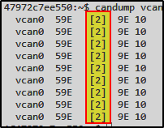

# BlockHarbor Proving Grounds - Data Field 1

**Category**: Getting Started<br>
**Points**: 5<br>
**Challenge description**: This challenge is within the Harborbay vehicle simulator on  [VSEC](https://vsec.blockharbor.io/). From the home page, enter HarborBay. Select the Mach-E UDS Challenge Simulation, then launch the terminal.

How many bytes of data are in the data field of the CAN frame being sent periodically on the CAN interface?

## TL;DR

Using the UDS Challenge Simulation in the HarborBay vehicle simulator, I monitored the CAN traffic with `candump vcan0`. The output showed that each CAN frame contained exactly 2 bytes of data in its data field, which was the answer to this challenge.

## Writeup

Just like the previous challenges, I followed the path:

1.  Dashboard → Garage
2.  Selected the UDS Challenge Simulation
3.  Launched the terminal

Now I needed to figure out how many bytes of data were in each CAN frame being transmitted on the bus.

### Diving Into CAN Frames

CAN frames consist of several parts, including an identifier (the Arbitration ID we found in the previous challenge) and a data field that carries the actual information.

To see the CAN frames in action, I used our trusty `candump` tool again:

```bash
candump vcan0
```

### Reading Between the Bytes

When you run `candump`, the output is:


<br>
Let's decode this:

-   First column: The CAN interface (`vcan0`)
-   Second column: The Arbitration ID (`59E`)
-   **Third column: Data length code in brackets (`[2]`)**
-   Remaining columns: The actual data bytes (`9E 10`)

That `[2]` is telling us something important - it indicates that there are 2 bytes in the data field. And looking at the data itself, we can confirm this by counting: `9E` is one byte, `10` is another byte. That's 2 bytes total!

**Flag**: `2`