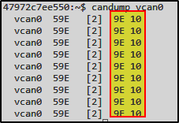

# BlockHarbor Proving Grounds - Data Field 2

**Category**: Getting Started<br>
**Points**: 5<br>
**Challenge description**: This challenge is within the Harborbay vehicle simulator on  [VSEC](https://vsec.blockharbor.io/). From the home page, enter HarborBay. Select the Mach-E UDS Challenge Simulation, then launch the terminal.

What is the value of the data field of the CAN frame being sent periodically on the CAN interface? Format: XXYY

## TL;DR

Continuing our exploration of the UDS Challenge Simulation, I used `candump vcan0` to monitor CAN traffic and focused on the actual data values being transmitted. The CAN frames consistently showed a data field with the value `9E 10`, which gives us our flag in the required format: `9E10`.

## Writeup

Just like the previous challenges, I followed the path:

1.  Dashboard → Garage
2.  Selected the UDS Challenge Simulation
3.  Launched the terminal

We've already identified the CAN interface (`vcan0`) and learned that each frame contains 2 bytes of data. Now we need to determine what those 2 bytes actually are!

### Capturing the Data

I ran our trusty CAN monitoring command:
```bash
candump vcan0
```

When analyzing the output, I paid close attention to the actual data bytes this time:



Let's break down what we're seeing:

-   First column: CAN interface (`vcan0`)
-   Second column: Arbitration ID (`59E`)
-   Third column: Data length code (`[2]`)
-   **Fourth column: The actual data bytes (`9E 10`)**

### Decoding the Mystery

The data field consistently showed `9E 10` across all messages. According to the challenge requirements, we need to format this as `XXYY`, which means removing the space between the bytes and presenting them as a single value: `9E10`.

**Flag**:`9E10`