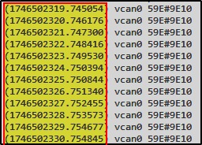

# BlockHarbor Proving Grounds - Message Frequency

**Category**: Getting Started<br>
**Points**: 5<br>
**Challenge description**: This challenge is within the Harborbay vehicle simulator on  [VSEC](https://vsec.blockharbor.io/). From the home page, enter HarborBay. Select the Mach-E UDS Challenge Simulation, then launch the terminal.

What is the frequency that the periodic CAN frame is transmit at? (in Hz)

## TL;DR

To determine the frequency of the periodic CAN frame, I captured timestamped CAN messages using `candump -L vcan0`. By analyzing the time intervals between consecutive messages, I calculated that the frames were being transmitted at approximately 1 Hz (once per second), which was the flag for this challenge.

## Writeup

Following our journey through the previous challenges, we now needed to figure out how often our CAN frame with ID `59E` was being transmitted. This is an important characteristic to understand in automotive systems, as different messages have different timing requirements based on their importance and function.

### Getting Timestamped Data

First, I needed to see the **CAN messages with their timestamps**. The basic `candump` command doesn't show timestamps by default, so I had to check out the available options:

```bash
candump -h
```

This revealed that the `-L` flag would include timestamps in the output - exactly what I needed! I decided to capture this data to a file for easier analysis:

```bash
candump -L vcan0 > canlog.txt
```

The `-L` flag formats the output with timestamps as shown in the screenshot below:



Notice the timestamps in parentheses at the beginning of each line? That's the key to calculating our frequency!


### Calculating the Frequency

Looking at the timestamps manually, I could see they were incrementing by approximately 1 second each time. But to be precise, I needed to calculate the average interval and convert it to frequency (Hz).

I crafted an `awk` command to process the log file *(with the help of AI/LLM of course)*:

```bash
awk -F'[() ]' '{print $2}' canlog.txt | awk 'NR>1{diff=$1-prev; sum+=diff; count++; prev=$1; next} {prev=$1} END {if(count>0) printf "Average interval: %.6f seconds\nFrequency: %.3f Hz\n", sum/count, count/sum; else print "No data for calculation"}'
```

This command performs several clever operations:

1.  Splits each line at parentheses or spaces to extract the timestamp
2.  Calculates the time difference between consecutive messages
3.  Computes the average interval and its reciprocal (the frequency)
4.  Includes error handling to avoid division by zero

### The Results

After running the command, I got:

```
Average interval: 1.000890 seconds
Frequency: 0.999 Hz
```

This tells us the CAN frame is being transmitted approximately once per second, which equates to a frequency of about 0.999 Hz.

Since the challenge likely wanted a whole number (and 0.999 is so close to 1), I rounded to the nearest integer: **1 Hz**

### What This Means in the Automotive World

In vehicle networks, message frequency can tell you a lot about the purpose of a message:

-   High-frequency messages (10-100 Hz) often relate to critical real-time systems like engine control or stability systems
-   Medium-frequency messages (1-10 Hz) might be for less critical but still important data like temperature readings
-   Low-frequency messages (< 1 Hz) are typically for status updates or non-critical systems

Our 1 Hz message would be considered a fairly standard update frequency for non-critical information in a vehicle network.

## Lessons Learned

This challenge taught me how to:

1.  Capture timestamped CAN data
2.  Process text data efficiently with Linux command-line tools
3.  Calculate timing information from logs
4.  Interpret the significance of message timing in automotive networks

**Flag**:`1`