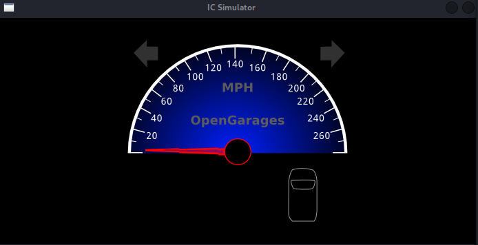
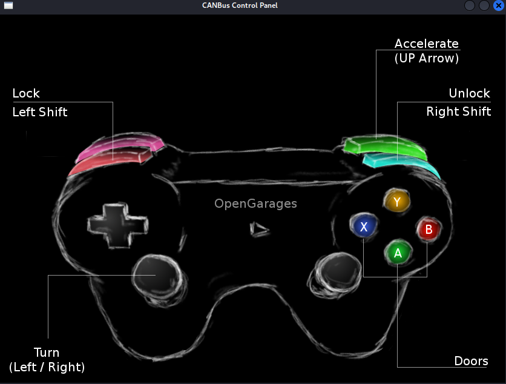
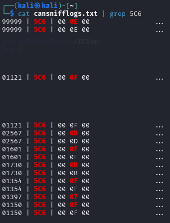

# BlockHarbor Proving Grounds - Unlock my door
**Category**: ICSim<br>
**Points**: 50<br>
**Challenge description**: Please download  [https://github.com/zombieCraig/ICSim](https://github.com/zombieCraig/ICSim)  and read the instructions to compile/run. Once setup, set the seed value -s 10000 for both the ./controls and ./icsim. Next Answer the following questions. Use any tool you would like in order to arrive at the answers.

What is the arbitration id for door unlocks?

NOTE: Submit in the format 0xARBID

## TL;DR

Using the Instrument Cluster Simulator (ICSim), I set up a virtual CAN environment with a specific seed value and monitored CAN traffic while triggering door unlock events. By using `cansniffer` with filtering techniques, I identified that arbitration ID `0x5C6` controlled door lock functions by observing how its second data byte changed when different doors were unlocked.

## Writeup

This challenge introduced us to ICSim (Instrument Cluster Simulator) - a fantastic tool for learning automotive security in a safe, virtual environment. Following the instructions, I first cloned the repository:

bash

```bash
git clone https://github.com/zombieCraig/ICSim
```

After compiling the software according to the instructions, I was ready to start working with the simulator. The challenge specified using seed value 10000, which is important because it ensures consistent CAN message IDs across different instances of the simulator.

### Launching the Simulation

I launched both the dashboard and controls with the specified seed:

```bash
./icsim -s 10000 vcan0
```
This opened a graphical dashboard showing a car instrument cluster.



---

```bash
./controls -s 10000 vcan0
```
This opened the control panel allowing me to interact with the virtual car - including unlocking doors!


### Monitoring CAN Traffic

Now for the fun part - sniffing CAN traffic to see what's happening when we unlock doors. I used `cansniffer`, a tool from the can-utils package that's perfect for this job:

```bash
cansniffer -c vcan0
```

The `-c` flag shows changes in color, making it easier to spot which bytes are changing when we perform actions.

### Finding the Door Unlock Arbitration ID

With `cansniffer` running, I started playing with the door unlock buttons on the control panel. Initially, the screen was full of constantly changing values - too much noise to spot our target message!

That's when I used a clever `cansniffer` feature - pressing `SHIFT+3` then ENTER key multiple times filters out bytes that are constantly changing, leaving only the interesting bits highlighted.

After applying this filtering, I watched carefully as I triggered door unlock events:

-   When unlocking the left front door: Second byte changed to `0E`
-   When unlocking the right front door: Second byte changed to `0D`
-   When unlocking the left back door: Second byte changed to `0B`
-   When unlocking the right back door: Second byte changed to `07`

All of these changes were happening in messages with arbitration ID **`0x5C6`** - our answer!



**Flag**:`0x5C6`