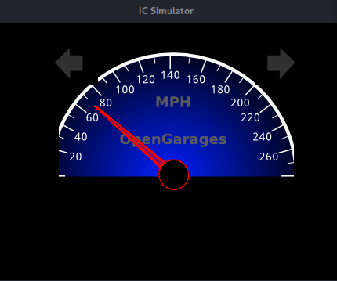
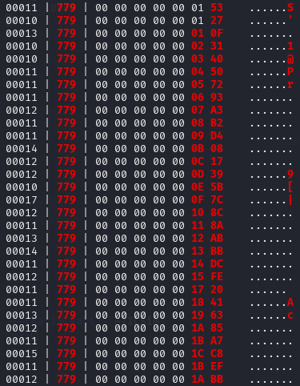

# BlockHarbor Proving Grounds - Speedometer ArbId
**Category**: ICSim 
**Points**: 50 
**Challenge description**: Please download  [https://github.com/zombieCraig/ICSim](https://github.com/zombieCraig/ICSim)  and read the instructions to compile/run. Once setup, set the seed value -s 10000 for both the ./controls and ./icsim. Next Answer the following questions. Use any tool you would like in order to arrive at the answers.

What is the abritration id for the speedometor display?

NOTE: Submit in the format 0xARBID

## TL;DR

Continuing to work with the Instrument Cluster Simulator (ICSim), I set up the virtual environment with the specified seed value and focused on identifying which CAN message controls the speedometer display. By manipulating the vehicle speed using the controls and monitoring CAN traffic changes with cansniffer, I observed that arbitration ID `0x779` directly controls the speedometer, with its sixth data byte increasing as the simulated speed increases.

## Writeup

I already had my environment set up:

1.  ICSim dashboard running: `./icsim -s 10000 vcan0`
2.  Controls panel active: `./controls -s 10000 vcan0`
3.  CAN monitoring ready: `cansniffer -c vcan0`

### Finding the Speed Demon

With everything running, I focused my attention on the speedometer needle in the dashboard. Time to put the pedal to the metal! I started pressing the UP arrow key on the control panel, which increases the simulated vehicle speed.

As the speedometer needle swept upward, I kept my eyes on the `cansniffer` output. Just like in the previous challenge, I used the SHIFT+3 filtering technique to reduce the noise and highlight only the changing bytes.

### The "Aha!" Moment

After a few seconds of increasing and decreasing the speed, a pattern emerged. I noticed that whenever I pressed the UP arrow:

1.  The speedometer needle climbed higher
2.  A message with arbitration ID `0x779` showed changes
3.  Specifically, the sixth byte of this message increased in value

Similarly, when pressing the DOWN arrow:

1.  The speedometer needle dropped
2.  The same `0x779` message showed changes
3.  The sixth byte decreased in value

The correlation was clear and consistent - arbitration ID `0x779` controls the speedometer display!

**Flag**:`0x779`