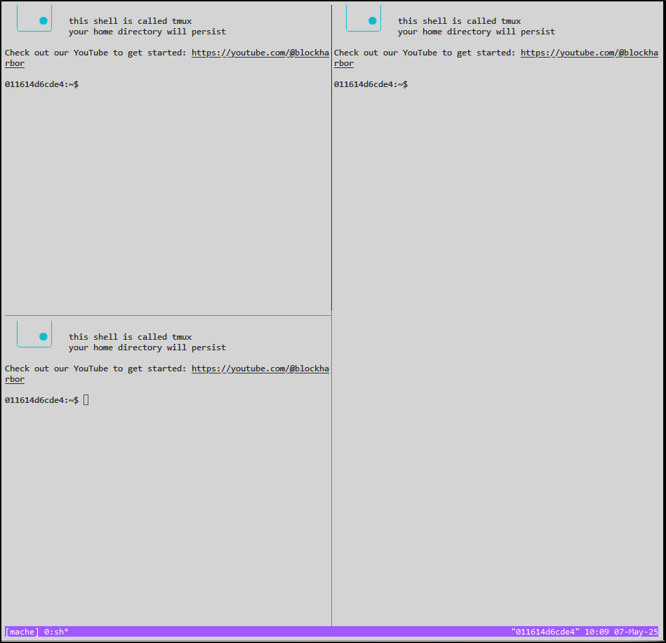
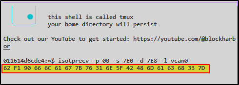

# BlockHarbor Proving Grounds - Simulation VIN
**Category**: VSEC Garage: UDS Challenge<br>
**Points**: 40<br>
**Challenge description**: This challenge is within the Harborbay vehicle simulator on  [VSEC](https://vsec.blockharbor.io/). From the home page, enter HarborBay. Select the Mach-E UDS Challenge Simulation, then launch the terminal.

Retrieve the VIN of the simulation using UDS.

## TL;DR

In this challenge, I needed to extract the Vehicle Identification Number (VIN) from a simulated vehicle using Unified Diagnostic Services (UDS) protocol. By sending a specific UDS request to read the VIN data identifier and capturing the response using **isotp tools**, I successfully retrieved the encoded VIN which, when converted from hex to ASCII, revealed the flag.

## Writeup

This challenge introduces us to UDS (Unified Diagnostic Services), a **diagnostic communication protocol** used in automotive ECUs (Electronic Control Units). Think of UDS as a specialized language that mechanics and technicians use to talk to your car's computers when diagnosing problems.

### Setting Up the Environment

After launching the UDS Challenge Simulation terminal, I needed to organize my workspace efficiently. Using tmux, I split the terminal into three separate windows to:

> CTRL+B > SHIFT+' = split terminal horizontally
> CTRL+B > SHIT+5 = split terminal vertically
> CTRL+B > arrowkeys = navigate between panes
> CTRL+B > x > y = close open panes

1.  Monitor all CAN traffic between specific addresses
2.  Listen for responses from the ECU
3.  Send diagnostic requests to the ECU



### The Hunt for the VIN

1. In the first window, I set up a monitoring system to capture the conversation:

```bash
candump vcan0 | grep "7E0\|7E8"
```

This command shows me all CAN messages going to address 7E0 (our requests) and coming from 7E8 (the ECU's responses) - think of it as eavesdropping on both sides of a phone call.

2. In the second window, I prepared to receive the ECU's response:


```bash
isotprecv -p 00 -s 7E0 -d 7E8 -l vcan0
```

This is like setting up a recording device specifically tuned to catch the ECU's reply.

3. Now for the exciting part - in the third window, I sent the actual request for the VIN:


```bash
echo "22 F1 90" | isotpsend -p 00 -s 7E0 -d 7E8 vcan0
```

### Breaking Down the UDS Request

Let's decode what this request actually means:

-   **22**: This is the UDS service identifier for "Read Data By Identifier" - essentially saying "please tell me about..."
-   **F1 90**: This is the specific Data Identifier (DID) for Vehicle Identification Number according to the ISO 14229 standard
-   **7E0**: The address we're sending to - typically the engine ECU in many vehicles
-   **7E8**: The address we expect a response from (usually ECU address + 8)
-   **vcan0**: Our virtual CAN interface

This is automotive security's equivalent of knocking on a specific door and asking a very precise question!

### Decoding the Response



Let's break it down:

-   **62**: This is the response code (service ID + 40) confirming a successful "Read Data By Identifier" response
-   **F1 90**: The same Data Identifier, echoed back to confirm what data we're receiving
-   **Remaining bytes**: The actual VIN data in hexadecimal format

### The Final Conversion

The remaining hex bytes are the VIN, but they're encoded in hexadecimal. To reveal the actual VIN, I needed to convert from hex to ASCII:

```
66 6C 61 67 7B 76 31 6E 5F 42 48 6D 61 63 68 33 7D
```

Translates to:

```
flag{v1n_BHmach3}
```

And there we have it - our flag!


## Lessons Learned

This challenge taught me several valuable skills:

-   Using isotp tools to communicate with automotive ECUs
-   Formatting and sending UDS requests
-   Interpreting UDS responses
-   Converting between different data formats (hex to ASCII)


Flag: **`flag{v1n_BHmach3}`**