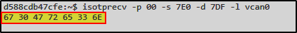

# BlockHarbor Proving Grounds - Startup Message
**Category**: VSEC Garage: UDS Challenge 
**Points**: 50 
**Challenge description**: This challenge is within the Harborbay vehicle simulator on  [VSEC](https://vsec.blockharbor.io/). From the home page, enter HarborBay. Select the Mach-E UDS Challenge Simulation, then launch the terminal.

It seems the simulation broadcasts some diagnostic information on arbitration ID 0x7DF when booting up, what does this message say? (in ASCII)

HINT: How can you get an ECU to restart?

## TL;DR

This challenge required intercepting a diagnostic message that's only broadcast during ECU startup. By using UDS commands to trigger an ECU reset and monitoring traffic on arbitration ID 0x7DF, I captured the startup message.

## Writeup

The challenge description gave us a critical clue - the message is broadcast on arbitration ID 0x7DF during boot-up. But how do we catch this message if the simulation is already running? The hint points us in the right direction: _"How can you get an ECU to restart?"_

This is where UDS (Unified Diagnostic Services) comes to the rescue again! Among its many services is the ability to reset ECUs - perfect for our needs.

Just like in the previous challenge, I organized my workspace using tmux with three windows to:

1.  Monitor specific CAN traffic: `candump vcan0 | grep "7E0\|7DF"`
    -   This lets me see all communication to/from address 7E0 (where I'll send commands) and 7DF (where the startup message should appear)
2.  Listen for responses: `isotprecv -p 00 -s 7E0 -d 7DF -l vcan0`
    -   This captures any messages sent to 7DF after my reset command
3.  Send the reset command: `echo "11 01" | isotpsend -p 00 -s 7E0 -d 7DF vcan0`

### Understanding the Reset Command

Let's decode the UDS command I sent:

-   **11**: This is the UDS service identifier for "ECU Reset" - basically telling the ECU "restart yourself"
-   **01**: This is the reset type - "Hard Reset" - the most thorough type of restart
-   **7E0**: The address we're sending to - our target ECU
-   **7DF**: The broadcast address where we expect diagnostic messages

### Capturing the Secret Message

After sending the reset command, the magic happened! In my monitoring window, I saw data appear on arbitration ID 0x7DF - the startup message we were hunting for. The ECU broadcast its initialization message in hexadecimal format.

### Decoding the Message

The final step was converting this hexadecimal data to ASCII to reveal the human-readable message. Using an online converter (rapidtables.com), the hex values translated to: **`g0Gre3n`**

**Flag**:`g0Gre3n`