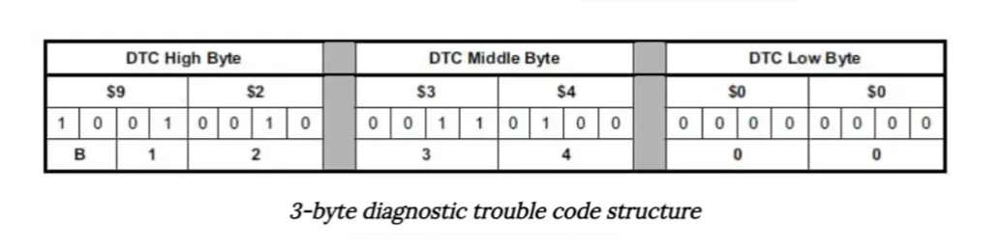
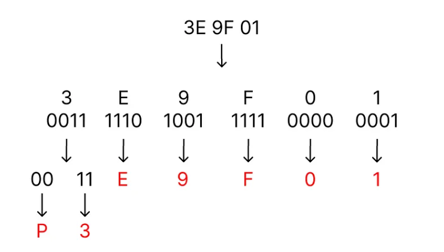

# BlockHarbor Proving Grounds - Engine Trouble?
**Category**: VSEC Garage: UDS Challenge<br>
**Points**: 75<br>
**Challenge description**: 
This challenge is within the Harborbay vehicle simulator on  [VSEC](https://vsec.blockharbor.io/). From the home page, enter HarborBay. Select the Mach-E UDS Challenge Simulation, then launch the terminal.

The simulation's engine light is on, can you read the diagnostic code?

## TL;DR

In this challenge, I used UDS (Unified Diagnostic Services) to retrieve the Diagnostic Trouble Code (DTC) causing the engine light to illuminate in the simulated vehicle. By sending a specific UDS request to read DTCs with active warning indicators and decoding the hexadecimal response according to standard DTC formatting rules, I identified the trouble code as `P3E9F-01`, indicating a powertrain-related issue.

## Writeup

Just as in previous challenges, I organized my workspace using tmux with three windows:

1.  A monitoring window to see the conversation:
    
    ```bash
    candump vcan0 | grep "7E0\|7E8"
    ```
    
2.  A listener to capture the ECU's response:
    
    ```bash
    isotprecv -p 00 -s 7E0 -d 7E8 -l vcan0
    ```
    
3.  A command window to send the diagnostic request:
    ```bash
    echo "19 02 80" | isotpsend -p 00 -s 7E0 -d 7E8 vcan0
    ```

### The Diagnostic Request Explained

Let's break down the UDS command I sent to read the trouble code:

-   **19**: This service ID means "Read Diagnostic Trouble Codes (DTCs)" - essentially asking "Tell me what's wrong"
-   **02**: This subfunction specifies "Report DTC By Status Mask" - allowing us to filter which types of DTCs we want
-   **80**: This is the status mask in hex (10000000 in binary) - where the '1' in bit 7 means "give me DTCs with active warning indicators" (like that illuminated check engine light!)

Imagine walking into a doctor's office and saying, "I only want to know about the serious problems that are causing visible symptoms right now." That's what this command is doing in car-speak!

### Decoding the Response

The ECU responded with:

```
59 02 80 3E 9F 01 AB
```

Let's interpret this:

-   **59**: Response code (19 + 40), confirming our "Read DTC" request was successful
-   **02 80**: Echo of our subfunction and status mask
-   **3E 9F 01**: The actual DTC in hexadecimal format
-   **AB**: Additional data (likely a checksum)

### Understanding DTC Format

Diagnostic Trouble Codes follow a standardized format, as shown in the images. The first byte tells us both the system affected and part of the trouble code:



The first character of a DTC indicates the system with the problem:

-   **P** = Powertrain (engine, transmission, etc.)
-   **C** = Chassis
-   **B** = Body
-   **U** = Network

Looking at our DTC (3E 9F 01), we need to decode the first byte (3E):

-   In binary: 0011 1110
-   The first two bits (00) indicate it's a Powertrain issue (P)
-   The next two bits (11) combined with the rest form the numerical part of the code

Converting the entire code:



This gives us **P3E9F-01** as our final decoded DTC.

## What This Means in the Real World

In a real vehicle, this code would point to a specific problem that a technician could look up. Codes starting with P3xxx are typically manufacturer-specific powertrain codes. The fact that it triggered the engine light indicates it's an issue the vehicle considers significant.

Interestingly, P3E9F-01 isn't a standard code you'd find in typical DTC databases, suggesting this is a simulation-specific code created for the challenge. In real-world automotive diagnostics, you'd use a repair database to look up the specific meaning of the code for your vehicle make and model.

## Lessons Learned

From this challenge, I learned:

-   How to request specific types of DTCs using status masks
-   The standardized format for decoding DTCs
-   How to interpret system and subsystem information from trouble codes
-   The relationship between warning lights and their underlying trouble codes

**Flag**: `P3E9F-01`