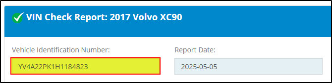

# BlockHarbor Proving Grounds - Finding a VIN

**Category**: Vehicle OSINT<br>
**Points**: 10<br>
**Challenge description**: 
Here's a license plate "DCR 660", it is registered in Michigan. Can you find the VIN?

## TL;DR

Using open-source intelligence (OSINT) techniques, I discovered that public vehicle information lookup services can provide Vehicle Identification Numbers (VINs) when given a license plate and state. After searching for reliable VIN lookup resources, I used vincheck.info to successfully retrieve the VIN `YV4A22PK1H1184823` associated with Michigan license plate DCR 660.

## Writeup

With only a license plate number **(DCR 660)** and state **(Michigan)** to work with, I needed to find a way to connect this information to a VIN. For those unfamiliar, a VIN is a 17-character code that serves as a vehicle's unique identifier - think of it as a car's fingerprint or DNA.

My first instinct was to search for reliable public resources that might offer this lookup capability. I started with a Google search:

```
US VIN lookup
```

## Finding the Right Tool

Among the search results, **vincheck.info** caught my attention as a potentially useful resource. This website offers various vehicle information lookups, including license plate to VIN conversion.

I navigated to the site and found their license plate lookup tool. After entering:

-   License plate: **DCR 660**
-   State: **Michigan**

The system processed my request and returned detailed vehicle information.

Within seconds, I had my answer! The VIN associated with Michigan license plate DCR 660 is:

**`YV4A22PK1H1184823`**




**Flag**:`YV4A22PK1H1184823`