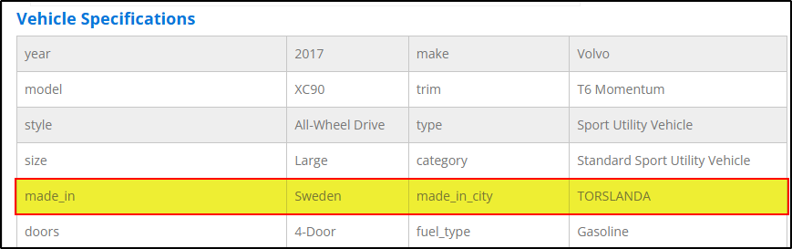

# BlockHarbor Proving Grounds - Manufactured at?

**Category**: Vehicle OSINT 
**Points**: 20 
**Challenge description**: Here's a license plate "DCR 660", it is registered in Michigan. Where was it manufactured at?

Format: City, Country

## TL;DR

Continuing our investigation of the vehicle associated with Michigan license plate DCR 660, I examined the manufacturing location details provided by vincheck.info. The VIN data revealed that this 2017 Volvo XC90 was manufactured at Volvo's production facility in Torslanda, Sweden, which gave us our flag in the required format.

## Writeup

Revisiting the detailed report from vincheck.info for the Michigan plate DCR 660, I found the manufacturing location specified as:

**Torslanda, Sweden**

**Flag**:`Torslanda, Sweden`