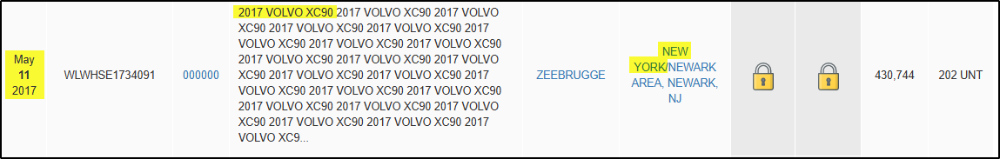

# BlockHarbor Proving Grounds - Imported when?

**Category**: Vehicle OSINT<br>
**Points**: 50<br>
**Challenge description**: Here's a license plate "DCR 660", it is registered in Michigan. When was this car imported to the US? Format: dd-mm-yyy

## TL;DR

Following the trail of our Michigan-registered 2017 Volvo XC90, I needed to find its specific import date to the US. This required looking beyond vincheck.info to shipping records. After cross-referencing exports data from Zauba.com with title records, I discovered the vehicle was imported through the Port of New York on May 11, 2017, giving us our answer: `11-05-2017`.

## Writeup


While vincheck.info had been helpful for the previous challenges, import dates require diving into shipping and customs records. This is where OSINT really shines - connecting different data sources to find hidden information.

## Expanding My Search

With the VIN (`YV4A22PK1H1184823`) and vehicle details (2017 Volvo XC90) already known, I crafted a targeted search:

```
2017 volvo xc90 YV4A22PK1H1184823 import date
```

Among the results, a particularly interesting one appeared: **V Exports From Sweden During May 2017** from zauba.com - a site that tracks international shipping data.

Show Image _(Imagine a screenshot of search results)_

## Narrowing Down the Possibilities

The Zauba data showed multiple shipments of 2017 Volvo XC90s arriving in the US throughout May 2017:

-   May 1, 2017
-   May 7, 2017
-   May 8, 2017
-   May 9, 2017
-   May 11, 2017
-   May 13, 2017
-   May 14, 2017
-   May 18, 2017
-   May 23, 2017
-   May 24, 2017
-   May 26, 2017

That's a lot of possible dates! I needed to narrow this down further.

### The Title Records Clue

Returning to vincheck.info, I noticed something I had overlooked earlier - the title records showed that the first state of title was **New York**. This was the critical missing piece!

If the car's first title was in New York, it likely entered the US through a New York port.

### Connecting the Dots

Back to the Zauba data, I filtered the results to show only shipments with:

1.  2017 Volvo XC90 models
2.  Port of discharge: New York

And there it was - a perfect match on **May 11, 2017**!



**Flag**: `11-05-2017`