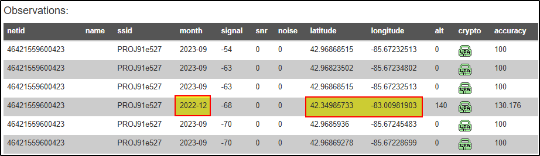

# BlockHarbor Proving Grounds - Mac Track!
**Category**: Vehicle OSINTe 
**Points**: 125 
**Challenge description**: We've managed to identify the MAC address of a vehicle of interest, can you help us track down where it was located on December 8'th, 2022? We need the latitude and longitude to two decimal places.

MAC: 2A:38:5C:91:E5:27

Hint: format XX.XX,XX.XX

## TL;DR

Using the Wigle Wi-Fi Database, I searched for the MAC address (2A:38:5C:91:E5:27) provided in the challenge. After creating an account and performing an advanced search with this MAC as the BSSID, I found one matching record. Looking through the historical data for December 8th, 2022, I discovered the coordinates (42.34985733, -83.00981903), which rounded to two decimal places gives us our answer: `42.35,-83.01`.

## Writeup

When I first saw this challenge, I was fascinated by the concept. Tracking a vehicle through its MAC address? That's straight out of a spy thriller! But it turns out this is absolutely possible in our hyperconnected world, where vehicles are basically computers on wheels, constantly broadcasting various wireless signals.

### What's a MAC Address Again?

For those who might not know, a MAC (Media Access Control) address is like a digital fingerprint for network devices. Every wireless device - including those in modern vehicles - has a unique MAC address that it uses when connecting to networks. Think of it as the device's ID card in the digital world.

Modern vehicles are packed with wireless tech - from Bluetooth to Wi-Fi hotspots - and each of these interfaces has its own MAC address that gets broadcast when the system is active.

### Finding the Right Tool for the Job

My first step was to figure out which tools could help track a device based on its MAC address. I asked ChatGPT for suggestions on what platforms might store historical MAC address location data, and among the options, one stood out: **Wigle Wi-Fi Database**.

#### What is Wigle?

Wigle (Wireless Geographic Logging Engine) is a fascinating platform - it's essentially a crowdsourced database of wireless networks from around the world. Users with the Wigle app contribute by wardriving (driving around collecting wireless network data), which builds a massive global map of Wi-Fi networks and their MAC addresses - along with when and where they were detected.

### The Hunt Begins

After creating an account on Wigle.net and logging in, I navigated to the advanced search feature:

1.  Clicked on the "View" tab in the navigation menu
2.  Selected "Advanced Search" from the dropdown

This brought me to a search form with various fields. The key field for our challenge was the "BSSID/MAC" field, where I entered our target: `2A:38:5C:91:E5:27`

### Striking Gold

After submitting the search, I got exactly one result - perfect! I clicked on the Net ID to view the detailed information about this network.

The detailed view showed me a wealth of information, including a map of where this MAC address had been spotted over time. Since the challenge specifically asked about December 8th, 2022, I needed to find records from that specific date.

Scrolling through the history records and filtering for "2022", I found the entry we needed. On December 8th, 2022, this MAC address was detected at:

-   Latitude: **42.34985733**
-   Longitude: **-83.00981903**

**Flag**:`42.35,-83.01`